# ComplianceGuard — Architecture & Tech Stack Guide

This document explains how the application is structured, how each technology interacts, and how data flows from your browser through FastAPI, PostgreSQL, Redis, Docker, and the scan pipeline.

**Related docs:**

- [DEPLOY_FREE.md](./DEPLOY_FREE.md) — Vercel + Render + Neon ($0 hosting)
- [DOCKER_LOCAL_WINDOWS.md](./DOCKER_LOCAL_WINDOWS.md) — step-by-step Docker on Windows
- [SCANNING.md](./SCANNING.md) — scan modes and scanner details
- [HARDENING_RECOMMENDATIONS.md](./HARDENING_RECOMMENDATIONS.md) — production security checklist

---

## Table of contents

1. [Complete tech stack](#1-complete-tech-stack)
2. [High-level system diagram](#2-high-level-system-diagram-docker-full-mode)
3. [Three runtime modes](#3-three-runtime-modes)
4. [Docker container startup flow](#4-docker-container-startup-flow)
5. [User interaction flows](#5-user-interaction-flows)
6. [Role of each technology](#6-role-of-each-technology)
7. [Frontend ↔ backend connection](#7-frontend--backend-connection)
8. [End-to-end request map](#8-end-to-end-request-map)
9. [Configuration flags](#9-configuration-flags)
10. [Docker startup walkthrough (Windows)](#10-docker-startup-walkthrough-windows)
11. [Quick reference — important files](#11-quick-reference--important-files)

---

## 1. Complete tech stack

| Layer | Technology | Role in this project |
|-------|------------|----------------------|
| **Frontend UI** | React 18, TypeScript, Vite | Dashboard, scans, findings, auth screens |
| **UI state** | Zustand | Auth tokens, user session |
| **API client** | Axios + React Query | HTTP calls, caching, loading states |
| **Styling** | Tailwind CSS, shadcn/ui | Components and layout |
| **Backend API** | **FastAPI** (Python 3.12) | REST API, WebSocket, auth, RBAC |
| **ORM / DB access** | SQLAlchemy 2 (async) + Alembic | Models, queries, migrations |
| **Database** | **PostgreSQL** (Docker/Neon) or **SQLite** (local dev) | Users, scans, findings, audit logs |
| **Task queue** | **Celery** | Background scan jobs |
| **Message broker** | **Redis** | Celery broker + result backend |
| **Scan tools** | Nmap, Nuclei, OWASP ZAP, HTTP probe | Vulnerability detection |
| **AI** | Anthropic Claude / OpenAI | Resolution guides, remediation |
| **Reports** | ReportLab | PDF generation |
| **Containerization** | **Docker** + Docker Compose | Runs API, worker, Postgres, Redis, ZAP |
| **Production hosting** | Vercel (UI) + Render (API) + Neon (DB) | Live demo deployment |

**Core idea:** You use the **React app** in the browser. It talks to **FastAPI**. FastAPI reads/writes **PostgreSQL**. Long scans go through **Redis → Celery worker** (when not in mock mode). Scanners run inside the **worker container** on an isolated Docker network.

---

## 2. High-level system diagram (Docker full mode)

This is the full local/production Docker setup from `docker/docker-compose.yml`:

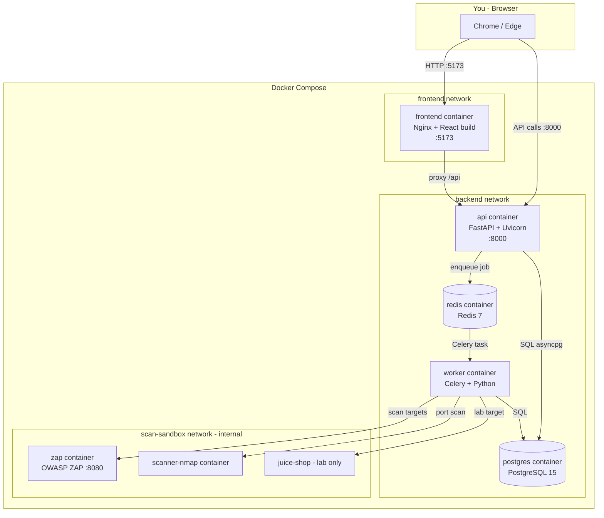

### Docker networks (security)

| Network | Purpose |
|---------|---------|
| `frontend` | Browser ↔ UI and API |
| `backend` | API, Postgres, Redis, worker |
| `scan-sandbox` | **Internal only** — scanners isolated from frontend; worker reaches ZAP/Nmap here |

---

## 3. Three runtime modes

The same codebase behaves differently depending on environment:

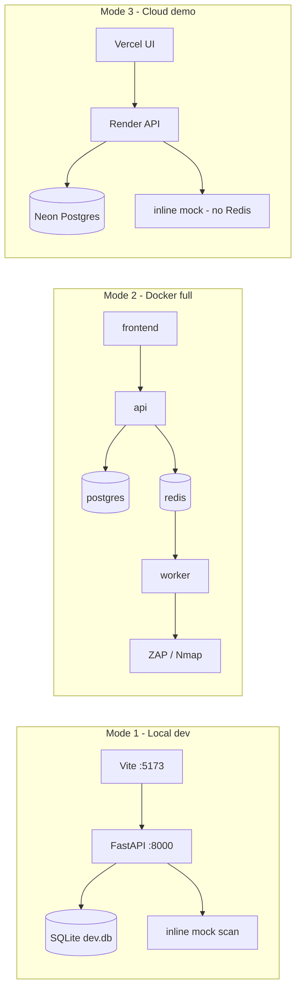

| Mode | How you start | Database | Redis | Scans |
|------|---------------|----------|-------|-------|
| **Local dev** | `scripts/start-dev.ps1` | SQLite file | None | Mock inline in API |
| **Docker Quick** | `scripts/start-docker.ps1 -Mode Quick` | Postgres in Docker | Redis in Docker | Mock via worker/background |
| **Docker Full** | `start-docker.ps1 -Mode Full` | Postgres in Docker | Redis in Docker | Real Nmap/Nuclei/ZAP |
| **Cloud (Render)** | Auto-deploy from GitHub | Neon Postgres | Not used | Mock inline in API |

---

## 4. Docker container startup flow

When you run `docker compose up`, the API container follows this path:

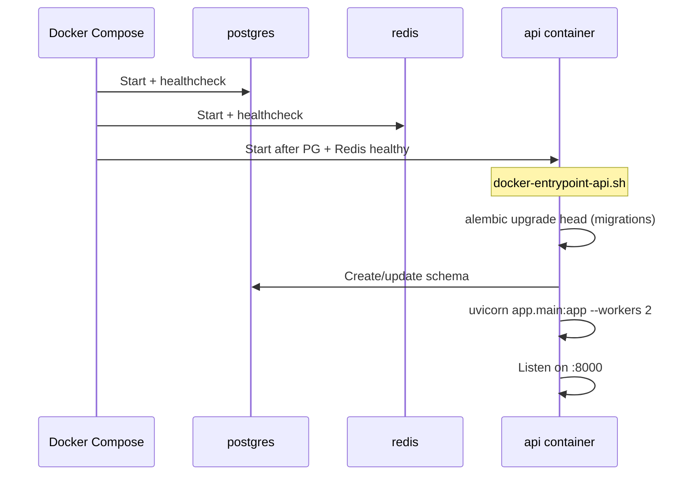

| Container | Built from | What runs inside |
|-----------|------------|------------------|
| `api` | `docker/Dockerfile.api` | Alembic migrations → Uvicorn + FastAPI |
| `worker` | `docker/Dockerfile.worker` | Celery worker + Nmap + Nuclei |
| `postgres` | `postgres:15-alpine` | PostgreSQL data store |
| `redis` | `redis:7-alpine` | Celery broker + result backend |
| `zap` | OWASP ZAP official image | ZAP daemon on port 8080 |
| `frontend` | `docker/Dockerfile.frontend` | Nginx serving React production build |

---

## 5. User interaction flows

### 5.1 Registration and login

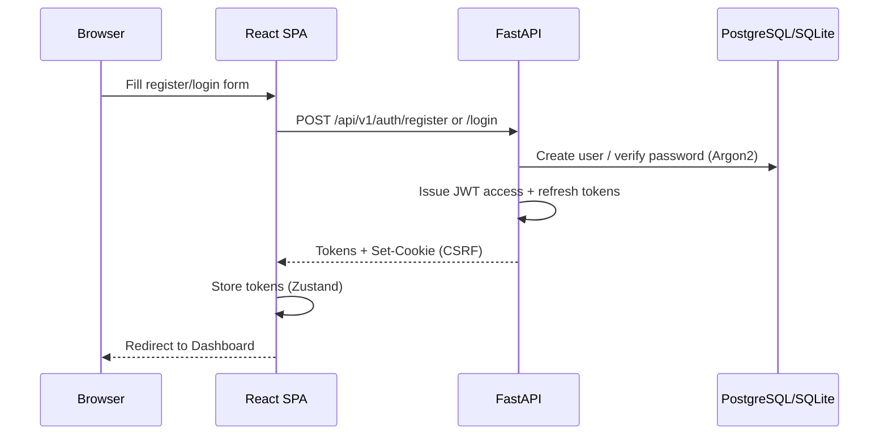

### 5.2 Add target and start scan (Docker full path)

When `SCAN_MOCK_MODE=false`, scans run asynchronously via Celery:

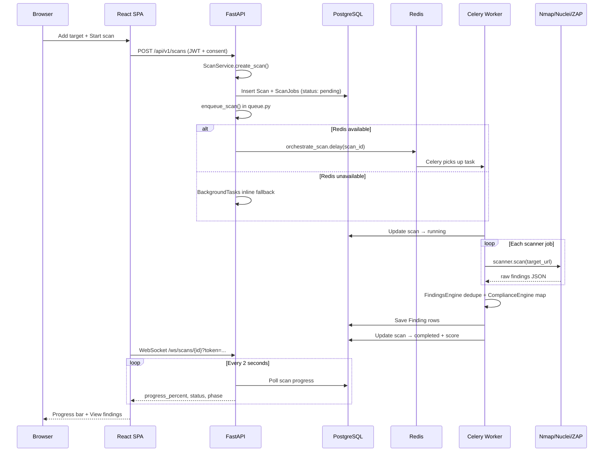

**Key code paths:**

| Step | File |
|------|------|
| Create scan API | `backend/app/api/v1/scans.py` |
| Business logic | `backend/app/services/scan_service.py` |
| Queue decision | `backend/app/workers/queue.py` |
| Celery config | `backend/app/workers/celery_app.py` |
| Full orchestration | `backend/app/workers/tasks.py` |
| Live progress | `backend/app/api/v1/websocket.py` |
| Frontend WS hook | `frontend/src/hooks/useScanWebSocket.ts` |

### 5.3 Scan flow on Render (cloud demo)

On Render, `SCAN_MOCK_MODE=true` — no Redis, no Celery worker:

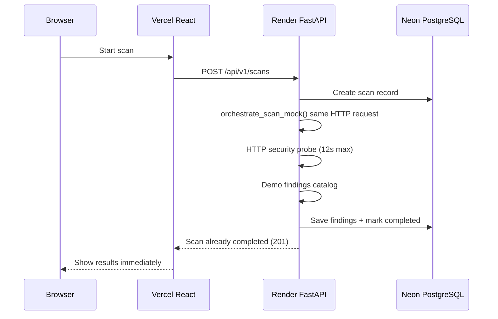

### 5.4 View findings and AI fix guide

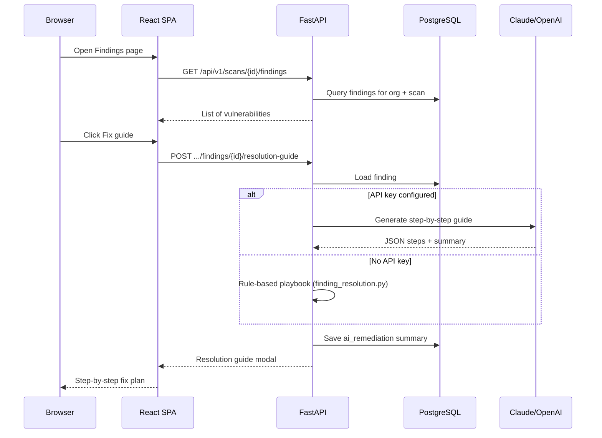

---

## 6. Role of each technology

### Python + FastAPI

**Python 3.12** runs the entire backend. **FastAPI** provides:

- HTTP REST endpoints (`/api/v1/...`)
- WebSocket (`/ws/scans/{id}`)
- Dependency injection (`get_db`, `require_permission`)
- Pydantic validation for request/response bodies
- Middleware: CORS, CSRF, rate limiting, security headers

```
Browser request
    → FastAPI middleware (CORS, CSRF, rate limit)
    → Router (auth, scans, audit, reports)
    → Service layer (scan_service, ai_service, etc.)
    → SQLAlchemy → PostgreSQL
```

Entry point: `backend/app/main.py`

### PostgreSQL

Stores all persistent data:

| Data | Examples |
|------|----------|
| Identity | users, organizations, roles |
| Scanning | authorized_targets, scans, scan_jobs |
| Results | findings (severity, CVE, evidence) |
| Compliance | framework mappings on findings |
| Security | audit_logs, refresh_tokens |

**Connections:**

- Local Docker: `postgresql+asyncpg://...@postgres:5432/...`
- Cloud: Neon with SSL (`backend/app/core/database.py`)
- Local dev: SQLite at `backend/dev.db`

Migrations run via Alembic on API startup in Docker.

### Redis

Redis is **not** used for application data storage. It is the **message bus** for Celery:

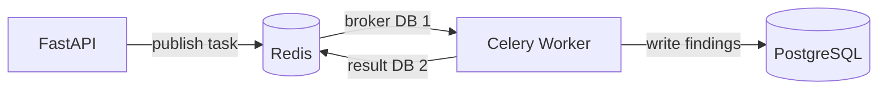

**Environment variables:**

```env
REDIS_URL=redis://:password@redis:6379/0
CELERY_BROKER_URL=redis://:password@redis:6379/1
CELERY_RESULT_BACKEND=redis://:password@redis:6379/2
```

**When Redis is skipped:** Render cloud (mock mode), local dev without Docker, or FastAPI `BackgroundTasks` fallback.

### Celery (Python worker)

1. API calls `orchestrate_scan.delay(scan_id)`
2. Task JSON goes to Redis broker
3. Worker process pulls the task
4. Worker runs `_orchestrate_scan()` — same Python code as inline mode
5. Worker updates PostgreSQL directly

Scans can take minutes to hours (especially ZAP). The API stays responsive because work runs in a separate process.

### Docker

Each component runs in an isolated container. See [DOCKER_LOCAL_WINDOWS.md](./DOCKER_LOCAL_WINDOWS.md) for full Windows instructions.

---

## 7. Frontend ↔ backend connection

### Local development (Vite proxy)

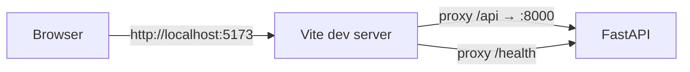

Configured in `frontend/vite.config.ts` — the browser only talks to Vite, avoiding CORS issues in dev.

### Production (Vercel → Render)

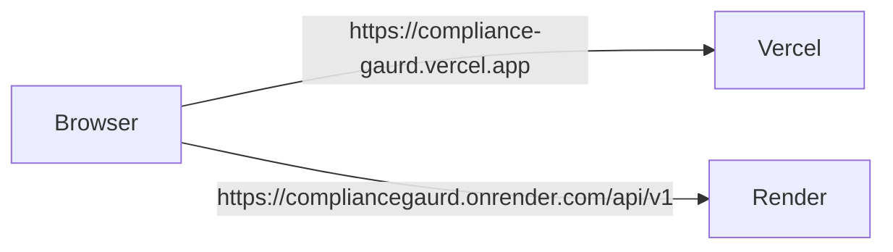

Set `VITE_API_URL` on Vercel. FastAPI CORS allows your Vercel domain (including preview deployments).

---

## 8. End-to-end request map

```
┌─────────────────────────────────────────────────────────────────┐
│                        YOUR BROWSER                              │
│  React + TypeScript + Axios + React Query + WebSocket           │
└────────────────────────────┬────────────────────────────────────┘
                             │ HTTP / WS
                             ▼
┌─────────────────────────────────────────────────────────────────┐
│                     FASTAPI (Python)                             │
│  main.py → routers → services → scanners/adapters               │
│  Middleware: CORS, JWT auth, RBAC, rate limit, CSRF              │
└──────┬──────────────────────────────┬───────────────────────────┘
       │ SQL (asyncpg)                 │ Celery enqueue
       ▼                               ▼
┌──────────────┐                 ┌──────────────┐
│  PostgreSQL  │                 │    Redis     │
│  (Neon/Docker)│                 │   (broker)   │
└──────────────┘                 └──────┬───────┘
       ▲                               │
       │ SQL                           │ task pull
       │                               ▼
       │                        ┌──────────────┐
       └────────────────────────│ Celery Worker │
                                │ Python + tools│
                                └──────┬───────┘
                                       │ HTTP/API
                                       ▼
                                ┌──────────────┐
                                │ ZAP / Nmap   │
                                │ HTTP probe   │
                                └──────────────┘
```

**One-line summary:** React → FastAPI → PostgreSQL; long scans → Redis → Celery worker → scanners → PostgreSQL; UI polls/WebSockets for progress.

On **Render today**, Redis and Celery are skipped — FastAPI runs mock scans inline.

---

## 9. Configuration flags

| Variable | When set | Effect |
|----------|----------|--------|
| `SCAN_MOCK_MODE` | `true` (Render) | No Nmap/Nuclei/ZAP; HTTP probe + demo findings |
| `SCAN_MOCK_HTTP_PROBE` | `true` | Real HTTP header/cookie checks in mock mode |
| `DATABASE_URL` | SQLite path | Local dev without Docker Postgres |
| `CELERY_BROKER_URL` | Redis URL | Enables async Celery worker path |
| `ANTHROPIC_API_KEY` / `OPENAI_API_KEY` | Set | Real AI fix guides |
| `AI_PROVIDER` | `auto` | Try Claude first, then OpenAI |

Defined in `backend/app/core/config.py` and `.env.example`.

---

## 10. Docker startup walkthrough (Windows)

### Prerequisites

1. Install [Docker Desktop](https://www.docker.com/products/docker-desktop/) (enable WSL 2 if prompted).
2. Open Docker Desktop and wait until **Engine running**.
3. Verify:

```powershell
docker --version
docker compose version
```

### Step 1 — Prepare environment

```powershell
cd "d:\Compliance gaurd"
Copy-Item .env.example .env -ErrorAction SilentlyContinue
```

Generate secrets if needed:

```powershell
python -c "import secrets; print('SECRET_KEY=' + secrets.token_hex(32))"
python -c "from cryptography.fernet import Fernet; print('FIELD_ENCRYPTION_KEY=' + Fernet.generate_key().decode())"
```

Add those values to `.env`.

### Step 2 — Choose a mode

| Goal | Command | What you get |
|------|---------|--------------|
| Verify Docker works (fast) | `.\scripts\start-docker.ps1 -Mode Quick` | Postgres + Redis + API + UI; HTTP probe scans |
| Full vulnerability scanning | `.\scripts\start-docker.ps1 -Mode Full` | Above + worker + ZAP + Nmap + Juice Shop |

First **Full** mode run may take 15–30 minutes (image downloads, Nuclei templates).

### Step 3 — What starts in each mode

**Quick mode** (`docker-compose.yml` + `docker-compose.quick.yml`):

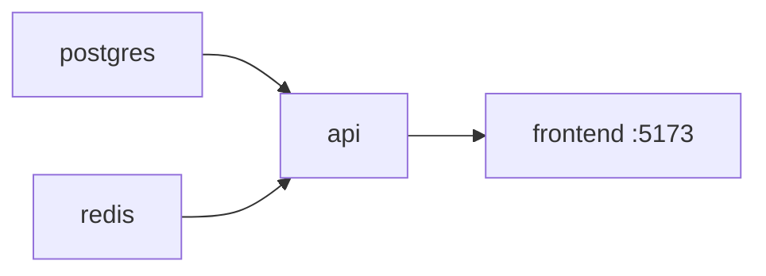

**Full mode** (adds `--profile scanning`):

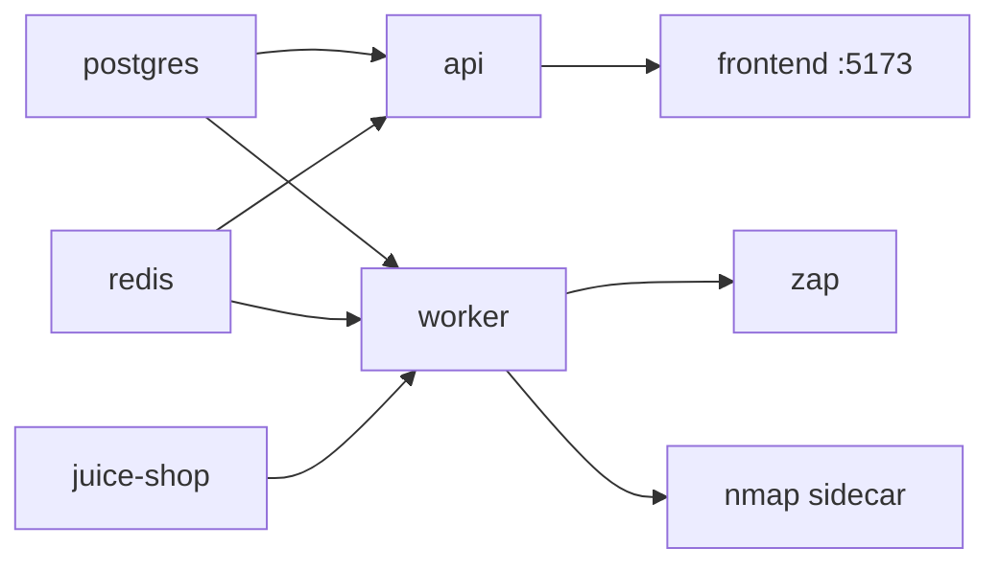

### Step 4 — Open the app

| Service | URL |
|---------|-----|
| **UI** | http://localhost:5173 |
| **API** | http://localhost:8000 |
| **API docs** | http://localhost:8000/docs |
| **Juice Shop** (Full mode) | http://localhost:3000 |

1. Register at http://localhost:5173
2. **Scans → Add target**
3. **New scan → Start**

**Suggested targets:**

| Mode | Target URL |
|------|------------|
| Quick | `https://testphp.vulnweb.com` |
| Full (inside Docker) | `http://juice-shop:3000` |
| Full (from host) | `http://host.docker.internal:3000` |

### Step 5 — Monitor and troubleshoot

```powershell
cd "d:\Compliance gaurd\docker"
docker compose ps
docker compose logs -f api worker
```

| Problem | Fix |
|---------|-----|
| `500 Internal Server Error` on `docker ps` | Start Docker Desktop; wait for engine |
| Port 5173 / 8000 in use | Stop conflicting apps or change ports in compose file |
| API not healthy | `docker compose logs api` — wait for Alembic migrations |
| Scan stuck (Full mode) | `docker compose logs -f worker` — ZAP can take 10+ min |
| 401 / CSRF on login | Hard refresh; use http://localhost:5173 |

### Step 6 — Stop the stack

```powershell
cd "d:\Compliance gaurd\docker"
docker compose --profile scanning down
```

Quick mode:

```powershell
docker compose -f docker-compose.yml -f docker-compose.quick.yml down
```

---

## 11. Quick reference — important files

| Purpose | Path |
|---------|------|
| FastAPI entry | `backend/app/main.py` |
| DB connection | `backend/app/core/database.py` |
| App configuration | `backend/app/core/config.py` |
| Docker stack | `docker/docker-compose.yml` |
| API Dockerfile | `docker/Dockerfile.api` |
| Worker Dockerfile | `docker/Dockerfile.worker` |
| API entrypoint (migrations) | `docker/docker-entrypoint-api.sh` |
| Celery + Redis | `backend/app/workers/celery_app.py` |
| Scan queue logic | `backend/app/workers/queue.py` |
| Scan orchestration | `backend/app/workers/tasks.py` |
| Mock scans (Render) | `backend/app/workers/mock_orchestrator.py` |
| Scan API routes | `backend/app/api/v1/scans.py` |
| WebSocket progress | `backend/app/api/v1/websocket.py` |
| Frontend API client | `frontend/src/lib/api.ts` |
| Vite dev proxy | `frontend/vite.config.ts` |
| Windows Docker guide | `docs/DOCKER_LOCAL_WINDOWS.md` |
| Free cloud deploy | `docs/DEPLOY_FREE.md` |

---

## Architecture evolution (future)

The recommended path for production scaling (not yet fully implemented):

1. **Now** — Modular monolith + inline mock on Render (demo)
2. **Next** — Add Upstash Redis + Celery worker on cloud; API returns quickly
3. **Later** — VPS with scan-sandbox for real Nmap/Nuclei/ZAP
4. **Scale** — Kubernetes or selective service extraction (AI, reports) only when load demands it

See team discussions and [HARDENING_RECOMMENDATIONS.md](./HARDENING_RECOMMENDATIONS.md) for production hardening items.
